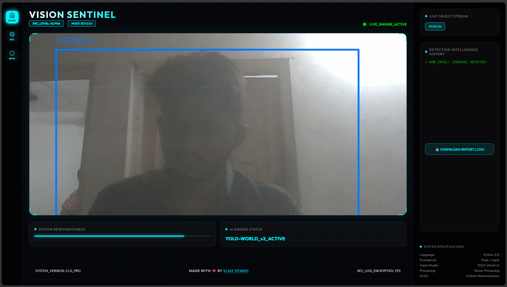
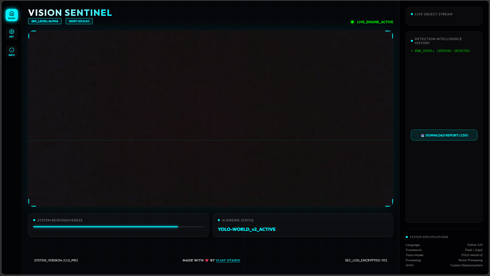
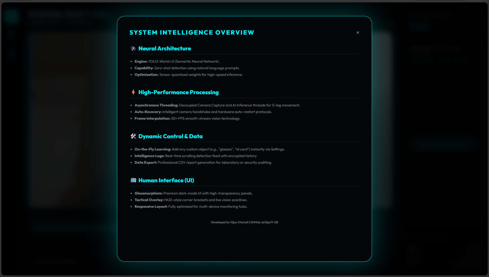

# 🛡️ Aegis Tactical Vision 

[](https://www.python.org/)
[](https://flask.palletsprojects.com/)
[](https://ultralytics.com/)
[](https://opensource.org/licenses/MIT)

**Aegis Tactical Vision** is a high-performance, real-time object detection dashboard built for professional-grade surveillance and intelligence gathering. Leveraging the power of **YOLOv8 World v2**, this platform provides a sub-millisecond response for identifying objects in diverse environments with a sleek, glassmorphic UI.

---

## 📸 Portfolio & Gallery

> [!NOTE]
> Add your project screenshots below to showcase the UI in action.

| Detection | Dashboard | Info |
| :---: | :---: | :---: |
|  |  |  |

---

## ⚡ Key Features

- 🎯 **Real-time Object Detection**: High-fidelity detection with bounding box overlays and dynamic class identification.
- 🚀 **Open-Vocabulary Engine**: Targeted detection of specific objects (Person, Laptop, Mouse, Phone, etc.) using `yolov8s-worldv2`.
- 📊 **Intelligence Logging**: Persistent tracking of all detected entities with timestamped history.
- 📂 **Data Export**: One-click CSV export of detection history for audit and analysis.
- 🎨 **Premium UI**: Modern tactical aesthetic with glassmorphism, glowing accents, and responsive layout.
- 🧵 **Multi-Threaded Architecture**: Separate threads for camera capture, AI inference, and the web server to ensure maximum FPS.

---

## 🛠️ Technology Stack

- **Backend**: Python (Flask)
- **AI Engine**: Ultralytics YOLOv8 (World v2)
- **Computer Vision**: OpenCV
- **Frontend**: HTML5, Vanilla CSS3 (Tactical Aesthetic), JavaScript
- **Data Persistence**: CSV-based Audit Logs

---

## 🚀 Quick Start

### 1. Prerequisites
Ensure you have Python 3.9+ installed and a working webcam.

### 2. Installation
```bash
# Clone the repository
git clone https://github.com/YOUR_USERNAME/Aegis-Tactical-Vision.git
cd Aegis-Tactical-Vision

# Install dependencies
pip install -r requirements.txt
```

### 3. Launching the Dashboard
Simply execute the provided batch file or run through Python:
```bash
python app.py
```
*The platform will automatically initialize the camera and open your default browser to `http://localhost:5000`.*

---

## 📂 Project Structure

```bash
.
├── app.py              # Main Application Controller
├── requirements.txt    # Library Dependencies
├── START_AI.bat        # Zero-click Execution Script
├── yolov8s-worldv2.pt  # AI Model Weight
├── static/
│   └── style.css       # Tactical Design Language
└── templates/
    ├── index.html      # Main Intelligence Dashboard
    └── about.html      # Project Documentation
```

---

## 🛡️ Security & Privacy
This system processes all data **locally**. No video feeds or detection logs are transmitted to external servers, ensuring complete privacy and data sovereignty for tactical operations.

---

## 👨‍💻 Contributing
We welcome contributions to enhance the tactical capabilities of Aegis. Please feel free to fork the repo and submit PRs!

---
*Created with ❤️ by [Vijay Otaradi](https://github.com/Vijay11-08)*
